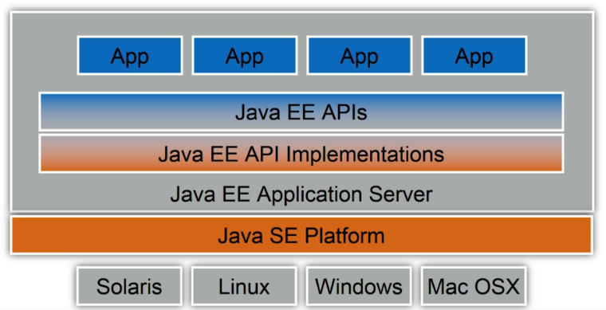
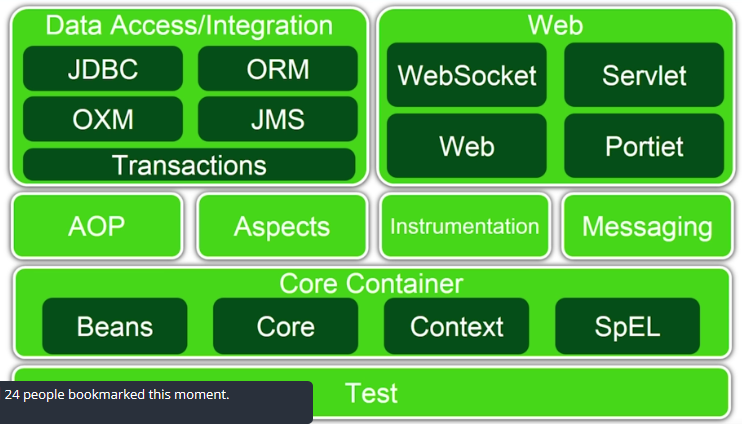
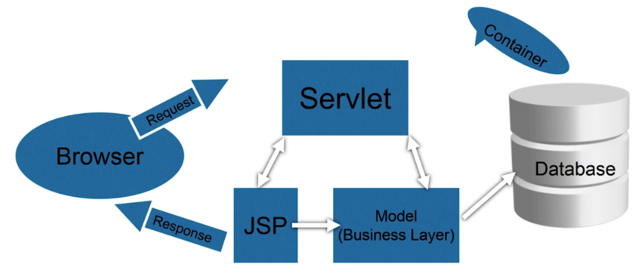

# Spring course

## Introduction into Java EE
It is a collection of technologies and APIs for the Java platfrom, designed to support "Enterprise" applications.

Enterprise applications can generally be classed as large-scale, distributed, transactional, and highly-available applications, designed to support mission-critical business requirements.

Java EE is used for banks or stock exchanges.

Some of the core technologies used in JEE are JDBC, JNDI, EJBs, RMI, JSP and Java servlets.

### Overview
<div align="center">
	
</div>

### Where does our web app code run ?
Web apps that we create, need to run in a container on the web server. We do not run them like we would a typical Java application.

These web servers woudl typically be housed in a 'server room' and connected to the internet, and as developers, we would deploy our apps to the machine "running" the web server.

We vill be using a web server called Tomcat in this course, and intalling and running it on our local machine for development purposes.

### What are components ?
JEE appplications are made up of components. They are self contained functional software assembled into a Java EE application. For example: Servlet, JSP pages, JSF...

## Spring
Spring is arguably the most popular Java application development framework for enterprises today. Spring framework is used by milions of developers around the world.

Spring framework is open source and was originally created by Rod Johnson.

Spring first release was made in June 2003 under the Apache 2.0 license. Spring was born out of necessity and specifically to address some huge problems faced by J2EE developers using the then comlicated and low performing EJB model of the time.

### Why Spring ?
* Spring provides comprehensive infrastructure support for developing Java applications. Spring handles the infrastructure so you can focus on the business logic.
* Spring is a lightweight framework.
	*	 Spring advocates the POJO (Plain old Java Object) programming model. POJOs avoid the need for a dedicated application server for deployment. These application can be massive, and consume vast resources. Instead we can easily use a lightweight webserver such as Tomcat for deploying Spring applications. As you have seen already Tomcat was a small download, and it does not consume a lot of resources either.
	*	 Spring is highly modular meaning you are free to pick and choose modules of Spring that meet your requirements and to then ignore the rest. This makes your application much more lightweight as they only include the modules you have decided on, which means smaller filesizes, reduced uploads, and hence faster deployment.
* Spring philosophy advocates the reuse of existing framework and technologies such as the Logging framework, the ORM framework, JEE itself and many more.
* Spring POJO programming model makes testing spring framework applications very easy.
* Spring makes life easy by allowing developers to focus on the business logic while it takes care of the low level "plumbing".

## Spring components
Spring contains four moduls Core container, Data access, Web and Test.

<div align="center">
	
</div>

### Core container
* Beans and core - the modules provide the basics of the framework such as IoC (Inversion of Control), DI (Dependency injection).
* Context - this module builds up on the foundation provided by Beans and Core modules and provides the means to access objects in a framework style.
* SpEL (Spring language expression) - provides Spring specific expression language for querying and manipulating objects.

**Inversion of Control**
The Inversion of Control (IoC) and Dependency Injection (DI) patterns are all about removing dependencies from your code.

For example, say your application has a text editor component and you want to provide spell checking. Your standard code would look something like this:

```
public class TextEditor {

    private SpellChecker checker;

    public TextEditor() {
        this.checker = new SpellChecker();
    }
}
```

What we've done here creates a dependency between the TextEditor and the SpellChecker. In an IoC scenario we would instead do something like this:

```
public class TextEditor {

    private IocSpellChecker checker;

    public TextEditor(IocSpellChecker checker) {
        this.checker = checker;
    }
}
```

In the first code example we are instantiating SpellChecker (this.checker = new SpellChecker();), which means the TextEditor class directly depends on the SpellChecker class.

In the second code example we are creating an abstraction by having the SpellChecker dependency class in TextEditor constructor signature (not initializing dependency in class). This allows us to call the dependency then pass it to the TextEditor class like so:

```
SpellChecker sc = new SpellChecker; // dependency
TextEditor textEditor = new TextEditor(sc);
```

Now the client creating the TextEditor class has the control over which SpellChecker implementation to use because we're injecting the dependency to the TextEditor signature.

**Dependency injection**

Spring helps in the creation of loosely coupled applications because of Dependency Injection.

In Spring, objects define their associations (dependencies) and do not worry about how they will get those dependencies. It is the responsibility of Spring to provide the required dependencies for creating objects.

Suppose we have an object Employee and it has a dependency on object Address. We would define a bean corresponding to Employee that will define its dependency on object Address.

When Spring tries to create an Employee object, it will see that Employee has a dependency on Address, so it will first create the Address object (dependent object) and then inject it into the Employee object.

**Context**

The ApplicationContext is the central interface within a Spring application for providing configuration information to the application. It is read-only at run time, but can be reloaded if necessary and supported by the application.

**POJO**

POJO is Plain Old Java Object is a Java object not bound by any restriction other than those forced by the Java Language Specification. I.e., a POJO should not have to extend prespecified classes, implement prespecified interface, contain prespecified annotations.

**Bean**

A bean is an object that is instantiated, assembled, and otherwise managed by a Spring IoC container. These beans are created with the configuration metadata that you supply to the container.

Bean is POJO object + metadata shortly.


### Data access/integration
* JDBC - interface (API) specification for connecting programs written in Java to the data in popular databases.
* ORM -  technique for converting data between incompatible type systems using object-oriented programming languages. Spring provide interface for famous ORM tools as Hibernate
* OXM - Spring Object XML Mappers
* JMS - allows integrations with JMS (Java messaging service)
* Transactions - allows creation of transactional applications

### Web
* WebSocket -  creates a persistent connection between a user and a web service for 2-way communication. 
* Sevlet - Java Servlets are server-side Java program modules that process and answer client requests and implement the servlet interface.
* Web - contains MVC architecture, JSP (Java servlet pages - are a server-side programming technology that enables the creation of dynamic web pages, it helps developers embed java code in normal HTML pages by making use of special JSP tags) 
* Portlet - similar as servlets but servlets can render complete web pages, whereas portlets renders html fragments.

## Test
This module provides support for creating applications for unit testing and integration testing.

## Concept of programming model in Spring
Spring is based on MVC (Model View Controller) design pattern. 

* Model: represents the state or data
* View: is responsible for displaying / formatting the data in the desired format. The view is actually represented by the JSP pages in your web app.
* Controller: manages all the requests and has the logic to decide where to forward them. A "Servlet" plays the role of controller here.

<div align="center">
	
</div>
 
